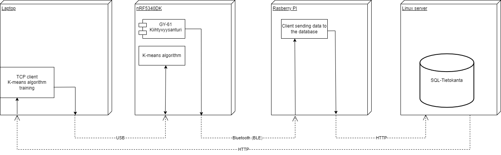
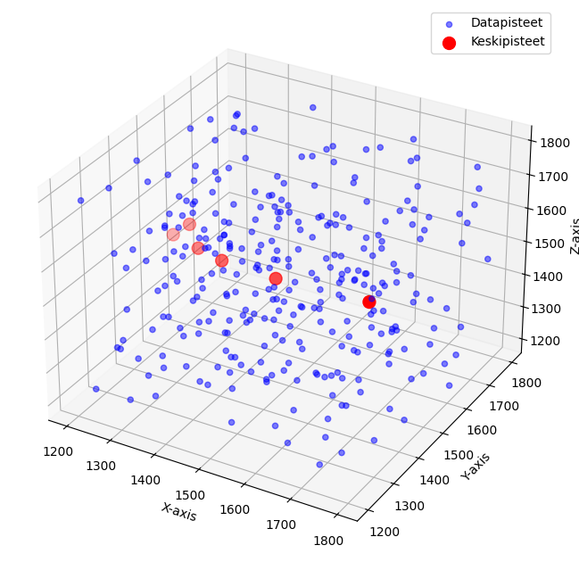

# Tietoliikenteen sovellusprojekti 2024
## Projektin aihe
Projektin aiheena on luoda anturidataa käsittelevä client, välittäen dataa langattomasti reitittimelle(Rasberry Pi). Reititin välittää datan tietokantaan, josta data noudetaan ja käsitellään clientillä.
Tietokantaan luodaan TCP-rajapinta ja HTTP API. Kerättyä dataa haetaan kannettavaan koodatulla ohjelmalla ja käytetään koneoppimistarkoituksiin.

## K-means algoritmi
Projektissa opetetaan k-means algoritmi tunnistamaan anturidatan osoittama suunta. Algoritmi opetetaan opetusdatalla, jota kerätään kuudesta eri suunnasta.
Opetukseen tehty ohjelma laskee kuusi satunnaista keskipistettä jokaista datapistettä kohden ja lajitteleen datapisteet lähimmälle satunnaisesti arvotulle pisteelle.
Keskipisteitä lasketaan monta kertaa, kunnes keskipiste ei enään muutu. Lopulliset pisteet tallennetaan .h tiedostoon, mikä liitetään suuntaa tunnistavaan koodiin.

