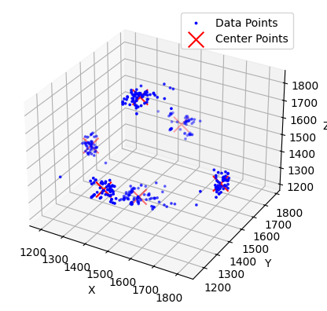

# Tietoliikenteen sovellusprojekti 2024
Projekti on toteutettu kahden hengen ryhmässä.

Antti Niiranen, Juho Sainmaa

## Projektin aihe
Projektin aiheena on luoda anturidataa käsittelevä client, välittäen dataa langattomasti reitittimelle(Raspberry Pi). Reititin välittää datan tietokantaan, josta data noudetaan ja käsitellään clientillä.
Tietokantaan luodaan TCP-rajapinta ja HTTP API. Kerättyä dataa haetaan kannettavaan koodatulla ohjelmalla ja käytetään koneoppimistarkoituksiin.

Projektissa käytetyt laitteet: NRF5340dk alustaa, Raspberry Pi(raspios_full_arm64), GY-61 kiihtyvyysanturi, kannettava tietokone.

Projektissa käytettyä ohjelmistoa: NRF Connect, VSCode, GitHub, Rufus.
  

> **KUVA 1**. Projektin arkkitehtuurikuva

## Opetusdatan kerääminen
Anturidataa kerätään nrf5340dk alustaa käyttäen. Alustalle on tehty koodi, joka lukee kiihtyvyysanturilta tulevaa dataa ja lähettää sen langattomasti Raspberry Pi -koneelle Bluetooth Low Energyn välityksellä.
Rasberry laitteelle on asennettu Linux ympäristö ja laitteelle on tehty Python ohjelma, mikä tilaa ja vastaanottaa nrf5340dk alustan bluetooth lähetystä.
Ohjelmalla vastaanotettu data lähetetään erillisellä linux palvelimella olevaan MySQL tietokantaan, mistä sitä käytetään k-means algoritmin opetukseen.

  
## K-means algoritmin opetus
Projektissa opetetaan k-means algoritmi tunnistamaan anturidatan osoittama suunta. Algoritmi opetetaan opetusdatalla, jota kerätään kuudesta eri suunnasta.
Tietokantaan tallennettu data haetaan pyhthon scriptillä, joka tallentaa datan CSV-tiedostoksi.

Opetukseen tehty ohjelma laskee kuusi satunnaista keskipistettä jokaista datapistettä kohden ja lajitteleen datapisteet lähimmälle satunnaisesti arvotulle keskipisteelle.
Jokaista keskipistettä vastaava datapisteiden arvot summataan ja jaetaan keskipisteitä vastaavien datapisteiden lukumäärällä. Näin saadaan laskettua uusi keskipiste, josta lasketaan uudet keskipisteet.
Keskipisteitä lasketaan jokaisesta datapisteestä, kunnes keskipisteet eivät enään muutu. Lopulliset pisteet tallennetaan .h tiedostoon, mikä liitetään k-means luokittelija koodiin.

> **KUVA 2**. K-means algoritmin keskipisteet ja datapisteet.

## Suuntaa tunnistava ohjelma

> **KUVA 3**. Konfuusiomatriisi anturin suunnasta.
